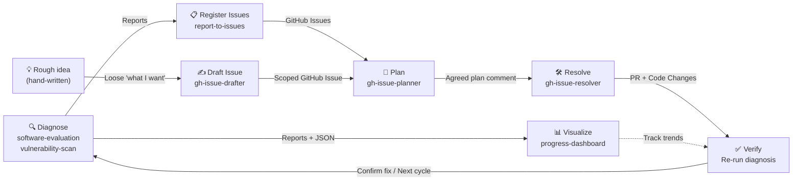

# Agent Skills

A collection of AI agent skills for software engineering workflows — code quality reviews, living documentation, and security audits. Built for developers and engineering teams who want Claude Code to apply expert-level analysis to their codebases.

## What are Skills?

Skills are Markdown files that give AI agents specialized knowledge, workflows, and output templates for specific tasks. When installed, Claude Code recognizes relevant requests and applies the skill automatically — no manual prompting required.

## Continuous Improvement Cycle

These skills form a continuous improvement loop for your codebase:



| Step | Skill | What happens |
|------|-------|-------------|
| **Diagnose** | `software-evaluation`, `vulnerability-scan` | Evaluate code quality and security, produce reports + JSON summaries |
| **Visualize** | `progress-dashboard` | Generate an interactive HTML dashboard from JSON summaries to track improvement trends |
| **Register** | `report-to-issues` | Parse reports, deduplicate against existing issues, create GitHub Issues |
| **Draft** | `gh-issue-drafter` | Turn a rough, hand-written intent into a scoped Issue (Done / Out of scope / Design constraints) — the human-authored entry point into the cycle |
| **Plan** | `gh-issue-planner` | Investigate the issue, propose a structured response plan, post the agreed plan as an issue comment |
| **Resolve** | `gh-issue-resolver` | Pick up the agreed plan comment, create a branch, implement, run tests, open a PR |
| **Verify** | Re-run `software-evaluation` or `vulnerability-scan` | Confirm the fix resolves the finding, close the loop |

> **Note:** `spec-doc` is independent of this cycle — use it anytime to generate or sync living documentation.

## Available Skills

| Skill | Description |
|-------|-------------|
| [spec-doc](skills/spec-doc/SKILL.md) | Generate or sync a "Living Specification" from source code to eliminate doc-code drift. Use when creating, updating, or reviewing architecture documentation for a directory or module. |
| [software-evaluation](skills/software-evaluation/SKILL.md) | Evaluate code quality across five pillars (Architecture, Reliability, Observability, Security, DX) and produce a 1–10 scorecard with a strategic improvement roadmap. |
| [vulnerability-scan](skills/vulnerability-scan/SKILL.md) | Run an OWASP-based offensive security audit using Semgrep and produce a read-only vulnerability report with severity ratings and remediation recommendations. |
| [report-to-issues](skills/report-to-issues/SKILL.md) | Parse reports from software-evaluation or vulnerability-scan, interactively select tasks, and register them as GitHub Issues using the `gh` CLI. |
| [gh-issue-drafter](skills/gh-issue-drafter/SKILL.md) | Turn a rough, hand-written intent into a well-scoped GitHub Issue. Proposes the missing Done definition, Out of scope, and Design constraints for user approval, then files the Issue with a scoped-issue marker that `gh-issue-planner` recognizes. |
| [gh-issue-planner](skills/gh-issue-planner/SKILL.md) | Fetch a GitHub Issue by ID, investigate related code, propose a structured response plan (approach, impact scope, implementation steps), and post the agreed plan as an issue comment. Implementation is out of scope. |
| [gh-issue-resolver](skills/gh-issue-resolver/SKILL.md) | Implement and verify a fix for a GitHub Issue whose response plan has already been posted as a comment by `gh-issue-planner`. Creates a branch, applies the agreed plan, runs tests, and opens a Pull Request. |
| [progress-dashboard](skills/progress-dashboard/SKILL.md) | Generate an interactive HTML dashboard that visualizes quality scores and security findings over time from JSON summaries. |

## Installation

### Option 1: CLI Install (Recommended)

```bash
npx skills add ymd38/dev-skills
```

This automatically installs all skills to your project's `.claude/skills/` directory.

To install a single skill:

```bash
npx skills add ymd38/dev-skills --skill spec-doc
```

### Option 2: Manual Copy

Copy any skill directory into your project:

```bash
cp -r skills/spec-doc .claude/skills/spec-doc
```

Or copy all skills at once:

```bash
cp -r skills/* .claude/skills/
```

### Option 3: Git Submodule

Add as a submodule to keep skills up to date with upstream changes:

```bash
git submodule add https://github.com/ymd38/dev-skills.git .claude/dev-skills
```

Then reference skills from `.claude/dev-skills/skills/`.

## Usage

Once installed, describe your task naturally and the relevant skill is applied automatically:

```
"Generate a spec for src/api/"
→ Uses spec-doc skill

"Review the code quality of src/backend/"
→ Uses software-evaluation skill

"Scan src/ for security vulnerabilities"
→ Uses vulnerability-scan skill

"Create GitHub Issues from docs/evaluation/myapp.20260406.md"
→ Uses report-to-issues skill

"Turn this into an issue" / "ざっくり書くのでIssueにして"
→ Uses gh-issue-drafter skill

"Plan issue #42" / "Issue #42の対応方針を立てて"
→ Uses gh-issue-planner skill

"Implement issue #42" / "Issue #42を実装して"
→ Uses gh-issue-resolver skill (requires an agreed plan comment from gh-issue-planner)

"Generate a progress dashboard" / "Show improvement trends"
→ Uses progress-dashboard skill
```

You can also invoke skills directly:

```
/spec-doc src/
/software-evaluation src/backend/
/vulnerability-scan src/
/report-to-issues docs/evaluation/myapp.20260406.md
/gh-issue-drafter
/gh-issue-planner
/gh-issue-resolver
/progress-dashboard
```

## Skill Categories

### Documentation
- `spec-doc` — Generates a machine-readable "Living Specification" (`docs/spec.md`) from source code. Covers architecture, interfaces, data models, state transitions, and development constraints. Syncs with existing specs rather than replacing them.

### Code Quality
- `software-evaluation` — Scores a codebase across five pillars with evidence-based findings (file:line citations required). Produces a prioritized roadmap with P0–P3 action items.

### Security
- `vulnerability-scan` — Combines automated Semgrep scanning with a manual review checklist covering OWASP Top 10. Triages true positives from false positives and includes a dependency CVE audit.

### Visualization
- `progress-dashboard` — Reads JSON summaries from `software-evaluation` and `vulnerability-scan`, then generates a self-contained HTML dashboard with quality score trends, radar charts, security findings trends, roadmap progress, and dependency risk panels.

### Issue Management
- `report-to-issues` — Decomposes evaluation or security-audit reports into actionable tasks, presents them for user selection, and registers the chosen items as GitHub Issues with appropriate labels and priority.
- `gh-issue-drafter` — Takes a loose, hand-written "what I want" and drafts the structure it almost always lacks (machine-checkable 完了条件, 触らない範囲, optional 設計方針). After author approval, files the Issue tagged with `<!-- gh-issue-drafter:scoped-issue -->` so `gh-issue-planner` treats the scope as binding. The human-authored counterpart to `report-to-issues`.
- `gh-issue-planner` — Fetches a GitHub Issue via `gh` CLI, classifies it (bug/feature/refactor/docs), searches related code, and presents a structured plan (approach, impact scope, steps, open questions). Posts the agreed plan as an issue comment tagged with `<!-- gh-issue-planner:agreed-plan -->`.
- `gh-issue-resolver` — Picks up the agreed plan comment posted by `gh-issue-planner`, creates a feature branch, applies the changes, runs tests, opens a Pull Request, and verifies the fix against the original issue.

## Progress Dashboard Preview


> Sample dashboard generated from 3 months of evaluation and security scan data. Open `examples/progress-dashboard/dashboard.html` in a browser to try it interactively.

## Examples

The `examples/progress-dashboard/` directory contains working sample data:

| File | Description |
|------|-------------|
| `evaluation/my-app.*.json` | 3 months of software-evaluation JSON summaries (Feb–Apr 2026) |
| `security-audit/my-app.*.json` | 3 months of vulnerability-scan JSON summaries (Feb–Apr 2026) |
| `dashboard.html` | Self-contained HTML dashboard with Chart.js — open in any browser |

## License

[MIT](LICENSE)
