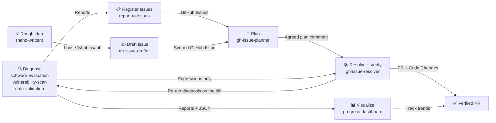

# Agent Skills

A collection of AI agent skills for software engineering workflows — code quality reviews, living documentation, and security audits. Built for developers and engineering teams who want Claude Code to apply expert-level analysis to their codebases.

## What are Skills?

Skills are Markdown files that give AI agents specialized knowledge, workflows, and output templates for specific tasks. When installed, Claude Code recognizes relevant requests and applies the skill automatically — no manual prompting required.

## Continuous Improvement Cycle

These skills form a continuous improvement loop for your codebase:



The `Resolve ⇄ Diagnose` arrows are the autonomous verification loop: `gh-issue-resolver`
re-runs the diagnosis on its own diff, fixes the findings **it caused**, and re-checks — up to
3 iterations, never outside the agreed plan's impact scope. Findings that predate the change
are handed to `report-to-issues` instead of being fixed in the same PR.

| Step          | Skill                                                          | What happens                                                                                                                                                                                                                                  |
| ------------- | -------------------------------------------------------------- | --------------------------------------------------------------------------------------------------------------------------------------------------------------------------------------------------------------------------------------------- |
| **Diagnose**  | `software-evaluation`, `vulnerability-scan`, `data-validation` | Evaluate code quality, security, and data correctness. The first two produce reports + JSON summaries; `data-validation` is session-output only by design                                                                                     |
| **Visualize** | `progress-dashboard`                                           | Generate an interactive HTML dashboard from JSON summaries to track improvement trends                                                                                                                                                        |
| **Register**  | `report-to-issues`                                             | Parse reports, deduplicate against existing issues, create GitHub Issues                                                                                                                                                                      |
| **Draft**     | `gh-issue-drafter`                                             | Turn a rough, hand-written intent into a scoped Issue (Done / Out of scope / Design constraints) — the human-authored entry point into the cycle                                                                                              |
| **Plan**      | `gh-issue-planner`                                             | Investigate the issue, propose a structured response plan, post the agreed plan as an issue comment                                                                                                                                           |
| **Resolve**   | `gh-issue-resolver`                                            | Pick up the agreed plan comment, create a branch, implement, run tests, open a PR                                                                                                                                                             |
| **Verify**    | `gh-issue-resolver` (Step 8)                                   | Re-run the triggered diagnoses on the diff, attribute each finding, **autonomously fix the regressions this change caused**, and hand pre-existing findings to `report-to-issues`. Bounded to 3 iterations and the agreed plan's impact scope |

> **Note:** `spec-doc` is independent of this cycle — use it anytime to generate or sync living documentation. `dev-skills-setup` is also independent: it installs the harness that makes this cycle the default path in a new project.

## Available Skills

| Skill                                                      | Description                                                                                                                                                                                                                                                                                         |
| ---------------------------------------------------------- | --------------------------------------------------------------------------------------------------------------------------------------------------------------------------------------------------------------------------------------------------------------------------------------------------- |
| [spec-doc](skills/spec-doc/SKILL.md)                       | Generate or sync a "Living Specification" from source code to eliminate doc-code drift. Use when creating, updating, or reviewing architecture documentation for a directory or module.                                                                                                             |
| [software-evaluation](skills/software-evaluation/SKILL.md) | Evaluate code quality across five pillars (Architecture, Reliability, Observability, Security, DX) and produce a 1–10 scorecard with a strategic improvement roadmap.                                                                                                                               |
| [vulnerability-scan](skills/vulnerability-scan/SKILL.md)   | Run an OWASP-based offensive security audit using Semgrep and produce a read-only vulnerability report with severity ratings and remediation recommendations.                                                                                                                                       |
| [data-validation](skills/data-validation/SKILL.md)         | Validate data read from the project's own fixtures or an explicitly configured non-production connection — record counts, NULL rates, distribution, uniqueness, referential integrity, and format validity — with sampled evidence rows and regression attribution. Read-only; produces no JSON.    |
| [report-to-issues](skills/report-to-issues/SKILL.md)       | Parse reports from software-evaluation or vulnerability-scan, interactively select tasks, and register them as GitHub Issues using the `gh` CLI.                                                                                                                                                    |
| [gh-issue-drafter](skills/gh-issue-drafter/SKILL.md)       | Turn a rough, hand-written intent into a well-scoped GitHub Issue. Proposes the missing Done definition, Out of scope, and Design constraints for user approval, then files the Issue with a scoped-issue marker that `gh-issue-planner` recognizes.                                                |
| [gh-issue-planner](skills/gh-issue-planner/SKILL.md)       | Fetch a GitHub Issue by ID, investigate related code, propose a structured response plan (approach, impact scope, implementation steps), and post the agreed plan as an issue comment. Implementation is out of scope.                                                                              |
| [gh-issue-resolver](skills/gh-issue-resolver/SKILL.md)     | Implement and verify a fix for a GitHub Issue whose response plan has already been posted as a comment by `gh-issue-planner`. Creates a branch, applies the agreed plan, runs tests, opens a Pull Request, then re-runs the diagnosis and autonomously fixes the regressions its own change caused. |
| [progress-dashboard](skills/progress-dashboard/SKILL.md)   | Generate an interactive HTML dashboard that visualizes quality scores and security findings over time from JSON summaries.                                                                                                                                                                          |
| [dev-skills-setup](skills/dev-skills-setup/SKILL.md)       | Install the full harness (CLAUDE.md + hooks + settings + rules) into the current project through a short interview — languages and commands are asked, never auto-detected.                                                                                                                         |

## Installation

### Full harness (recommended for new projects)

Skills alone give workflows (L1). The full harness adds mechanical guardrails —
format-on-write and dangerous-command hooks, a lean CLAUDE.md, cycle rules,
GitHub Actions CI, and a security scan — so quality is maintained from day one
and the continuous improvement cycle is the default path (L2–L3).

With `--langs`, the installer also generates:

- `.github/workflows/ci.yml` — per-language jobs (Go: tidy-check / build / `test -race` / pinned golangci-lint; Node: frozen-lockfile install / lint / typecheck / test; Python: ruff / pytest)
- `.github/workflows/security-scan.yml` — gitleaks (gating from day one), trivy + semgrep (staged `continue-on-error`), Node production-dependency audit
- `.gitleaks.toml`, `.env.example`, and `.gitignore` entries for `.env`

Disable with `--no-ci`. Tool and action versions are pinned (no `@latest`).

| Entry point                        | When to use                                                                     |
| ---------------------------------- | ------------------------------------------------------------------------------- |
| `curl \| bash` one-liner           | Fresh machine / CI / "just drop the files in" (non-interactive, flags required) |
| `harness/scripts/setup.sh`         | You already cloned this repo                                                    |
| `/dev-skills-setup` in Claude Code | Decide languages and commands interactively (no auto-detection)                 |

```bash
# One-liner — full (languages are explicit, never detected)
curl -fsSL https://raw.githubusercontent.com/ymd38/dev-skills/main/harness/scripts/install.sh \
  | bash -s -- --langs go,typescript --pm pnpm --with-skills

# One-liner — minimal (rails only; decide languages later via /dev-skills-setup)
curl -fsSL https://raw.githubusercontent.com/ymd38/dev-skills/main/harness/scripts/install.sh \
  | bash -s -- --minimal

# From a clone
./harness/scripts/setup.sh --target /path/to/your-project --langs python --python-pm uv
```

Prefer inspecting scripts before piping to bash:

```bash
curl -fsSL https://raw.githubusercontent.com/ymd38/dev-skills/main/harness/scripts/install.sh -o install.sh
less install.sh && bash install.sh --langs go
```

Existing `CLAUDE.md` / `.claude/settings.json` / hooks are never overwritten
(pass `--force` to override); `settings.json` hooks are merged, not replaced.
Supported languages: Go, Python, TypeScript, JavaScript. Run `setup.sh --help` for all flags.

### Skills only

#### Option 1: CLI Install (Recommended)

```bash
npx skills add ymd38/dev-skills
```

This automatically installs all skills to your project's `.claude/skills/` directory.

To install a single skill:

```bash
npx skills add ymd38/dev-skills --skill spec-doc
```

#### Option 2: Manual Copy

Copy any skill directory into your project:

```bash
cp -r skills/spec-doc .claude/skills/spec-doc
```

Or copy all skills at once:

```bash
cp -r skills/* .claude/skills/
```

#### Option 3: Git Submodule

Add as a submodule to keep skills up to date with upstream changes:

```bash
git submodule add https://github.com/ymd38/dev-skills.git .claude/dev-skills
```

Then reference skills from `.claude/dev-skills/skills/`.

## Usage

Once installed, describe your task naturally and the relevant skill is applied automatically:

```
"Generate a spec for src/api/"
→ Uses spec-doc skill

"Review the code quality of src/backend/"
→ Uses software-evaluation skill

"Scan src/ for security vulnerabilities"
→ Uses vulnerability-scan skill

"Check the data quality of db/" / "データ検証して" / "NULL率を調べて"
→ Uses data-validation skill

"Create GitHub Issues from docs/evaluation/myapp.20260406.md"
→ Uses report-to-issues skill

"Turn this into an issue" / "ざっくり書くのでIssueにして"
→ Uses gh-issue-drafter skill

"Plan issue #42" / "Issue #42の対応方針を立てて"
→ Uses gh-issue-planner skill

"Implement issue #42" / "Issue #42を実装して"
→ Uses gh-issue-resolver skill (requires an agreed plan comment from gh-issue-planner)

"Generate a progress dashboard" / "Show improvement trends"
→ Uses progress-dashboard skill

"Set up the harness" / "セットアップして" / "ハーネスを入れて"
→ Uses dev-skills-setup skill (interview-style, writes only after approval)
```

You can also invoke skills directly:

```
/spec-doc src/
/software-evaluation src/backend/
/vulnerability-scan src/
/data-validation db/
/report-to-issues docs/evaluation/myapp.20260406.md
/gh-issue-drafter
/gh-issue-planner
/gh-issue-resolver
/progress-dashboard
/dev-skills-setup
```

## Skill Categories

### Documentation

- `spec-doc` — Generates a machine-readable "Living Specification" (`docs/spec.md`) from source code. Covers architecture, interfaces, data models, state transitions, and development constraints. Syncs with existing specs rather than replacing them.

### Code Quality

- `software-evaluation` — Scores a codebase across five pillars with evidence-based findings (file:line citations required). Produces a prioritized roadmap with P0–P3 action items.

### Security

- `vulnerability-scan` — Combines automated Semgrep scanning with a manual review checklist covering OWASP Top 10. Triages true positives from false positives and includes a dependency CVE audit.

### Data

- `data-validation` — Checks record counts, NULL rates (including empty strings, zero values, and sentinels), value distribution, uniqueness, referential integrity, and format validity. Reads only from the project's own fixtures/seeds or an explicitly configured non-production connection — never a guessed or production source. Every finding carries up to 5 sampled rows with PII masked, and every expectation is traced back to a schema constraint, type definition, or test assertion. Classifies each finding as `regression` / `pre-existing` / `environmental` so `gh-issue-resolver` knows what it is allowed to fix. **Writes no JSON and, by default, no file at all** — routine validation should not grow the commit target.

### Visualization

- `progress-dashboard` — Reads JSON summaries from `software-evaluation` and `vulnerability-scan`, then generates a self-contained HTML dashboard with quality score trends, radar charts, security findings trends, roadmap progress, and dependency risk panels.

### Issue Management

- `report-to-issues` — Decomposes evaluation or security-audit reports into actionable tasks, presents them for user selection, and registers the chosen items as GitHub Issues with appropriate labels and priority.
- `gh-issue-drafter` — Takes a loose, hand-written "what I want" and drafts the structure it almost always lacks (machine-checkable 完了条件, 触らない範囲, optional 設計方針). After author approval, files the Issue tagged with `<!-- gh-issue-drafter:scoped-issue -->` so `gh-issue-planner` treats the scope as binding. The human-authored counterpart to `report-to-issues`.
- `gh-issue-planner` — Fetches a GitHub Issue via `gh` CLI, classifies it (bug/feature/refactor/docs), searches related code, and presents a structured plan (approach, impact scope, steps, open questions). Posts the agreed plan as an issue comment tagged with `<!-- gh-issue-planner:agreed-plan -->`.
- `gh-issue-resolver` — Picks up the agreed plan comment posted by `gh-issue-planner`, creates a feature branch, applies the changes, runs tests, opens a Pull Request, and verifies the fix against the original issue. Verification is autonomous: it re-runs whichever diagnoses the diff triggers, attributes each finding against the base branch, and fixes the `regression`-class findings itself — bounded to 3 iterations and to the agreed plan's impact scope, returning to `gh-issue-planner` when it hits either wall. `pre-existing` findings are never fixed in the same PR; they are offered to `report-to-issues`.

### Setup

- `dev-skills-setup` — Installs the full harness into the current project through a short interview: a lean `CLAUDE.md` (Stack & commands, cycle, hard rules), four hooks (format-on-write, dangerous-bash guard, SessionStart context, Stop nudge), a merged `.claude/settings.json`, and `.claude/rules/dev-skills-cycle.md`. Languages (Go / Python / TypeScript / JavaScript) are asked, never auto-detected; nothing is written before the confirmation summary is approved. The non-interactive counterparts are `harness/scripts/install.sh` (one-liner) and `harness/scripts/setup.sh`.

## Progress Dashboard Preview


> Sample dashboard generated from 3 months of evaluation and security scan data. Open `examples/progress-dashboard/dashboard.html` in a browser to try it interactively.

## Examples

The `examples/progress-dashboard/` directory contains working sample data:

| File                           | Description                                                       |
| ------------------------------ | ----------------------------------------------------------------- |
| `evaluation/my-app.*.json`     | 3 months of software-evaluation JSON summaries (Feb–Apr 2026)     |
| `security-audit/my-app.*.json` | 3 months of vulnerability-scan JSON summaries (Feb–Apr 2026)      |
| `dashboard.html`               | Self-contained HTML dashboard with Chart.js — open in any browser |

## License

[MIT](LICENSE)
