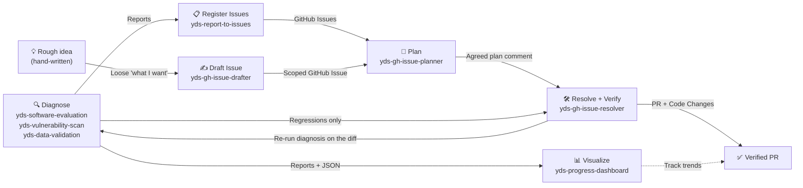
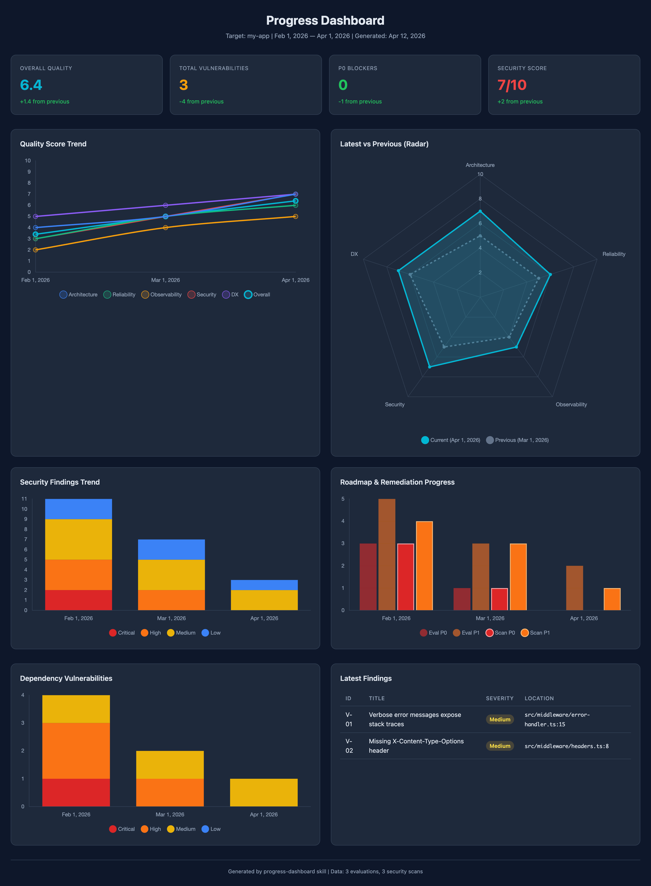

# Agent Skills

A collection of Claude Code agent skills plus a full **project harness** for AI-assisted development — code quality reviews, security audits, living documentation, GitHub-issue-driven implementation with autonomous verification, and day-one CI/security gates (gitleaks, Semgrep, Trivy). Built on **harness engineering** and **loop engineering** principles: the environment enforces quality mechanically (hooks, strict CI, branch protection) while a bounded improvement loop (diagnose → issue → plan → resolve ⇄ verify) does the work.

## What are Skills?

Skills are Markdown files that give AI agents specialized knowledge, workflows, and output templates for specific tasks. When installed, Claude Code recognizes relevant requests and applies the skill automatically — no manual prompting required.

## Continuous Improvement Cycle

These skills form a continuous improvement loop for your codebase:



The `Resolve ⇄ Diagnose` arrows are the autonomous verification loop: `yds-gh-issue-resolver`
re-runs the diagnosis on its own diff, fixes the findings **it caused**, and re-checks — up to
3 iterations, never outside the agreed plan's impact scope. Findings that predate the change
are handed to `yds-report-to-issues` instead of being fixed in the same PR.

| Step          | Skill                                                          | What happens                                                                                                                                                                                                                                  |
| ------------- | -------------------------------------------------------------- | --------------------------------------------------------------------------------------------------------------------------------------------------------------------------------------------------------------------------------------------- |
| **Diagnose**  | `yds-software-evaluation`, `yds-vulnerability-scan`, `yds-data-validation` | Evaluate code quality, security, and data correctness. The first two produce reports + JSON summaries; `yds-data-validation` is session-output only by design                                                                                     |
| **Visualize** | `yds-progress-dashboard`                                           | Generate an interactive HTML dashboard from JSON summaries to track improvement trends                                                                                                                                                        |
| **Register**  | `yds-report-to-issues`                                             | Parse reports, deduplicate against existing issues, create GitHub Issues                                                                                                                                                                      |
| **Draft**     | `yds-gh-issue-drafter`                                             | Turn a rough, hand-written intent into a scoped Issue (Done / Out of scope / Design constraints) — the human-authored entry point into the cycle                                                                                              |
| **Plan**      | `yds-gh-issue-planner`                                             | Investigate the issue, propose a structured response plan, post the agreed plan as an issue comment                                                                                                                                           |
| **Resolve**   | `yds-gh-issue-resolver`                                            | Pick up the agreed plan comment, create a branch, implement, run tests, open a PR                                                                                                                                                             |
| **Verify**    | `yds-gh-issue-resolver` (Step 8)                                   | Re-run the triggered diagnoses on the diff, attribute each finding, **autonomously fix the regressions this change caused**, and hand pre-existing findings to `yds-report-to-issues`. Bounded to 3 iterations and the agreed plan's impact scope |

> **Note:** `yds-spec-doc` is independent of this cycle — use it anytime to generate or sync living documentation. `yds-setup` is also independent: it installs the harness that makes this cycle the default path in a new project.

## Available Skills

| Skill                                                      | Description                                                                                                                                                                                                                                                                                         |
| ---------------------------------------------------------- | --------------------------------------------------------------------------------------------------------------------------------------------------------------------------------------------------------------------------------------------------------------------------------------------------- |
| [yds-spec-doc](skills/yds-spec-doc/SKILL.md)                       | Generate or sync a "Living Specification" from source code to eliminate doc-code drift. Use when creating, updating, or reviewing architecture documentation for a directory or module.                                                                                                             |
| [yds-software-evaluation](skills/yds-software-evaluation/SKILL.md) | Evaluate code quality across five pillars (Architecture, Reliability, Observability, Security, DX) and produce a 1–10 scorecard with a strategic improvement roadmap.                                                                                                                               |
| [yds-vulnerability-scan](skills/yds-vulnerability-scan/SKILL.md)   | Run an OWASP-based offensive security audit using Semgrep and produce a read-only vulnerability report with severity ratings and remediation recommendations.                                                                                                                                       |
| [yds-data-validation](skills/yds-data-validation/SKILL.md)         | Validate data read from the project's own fixtures or an explicitly configured non-production connection — record counts, NULL rates, distribution, uniqueness, referential integrity, and format validity — with sampled evidence rows and regression attribution. Read-only; produces no JSON.    |
| [yds-report-to-issues](skills/yds-report-to-issues/SKILL.md)       | Parse reports from yds-software-evaluation or yds-vulnerability-scan, interactively select tasks, and register them as GitHub Issues using the `gh` CLI.                                                                                                                                                    |
| [yds-gh-issue-drafter](skills/yds-gh-issue-drafter/SKILL.md)       | Turn a rough, hand-written intent into a well-scoped GitHub Issue. Proposes the missing Done definition, Out of scope, and Design constraints for user approval, then files the Issue with a scoped-issue marker that `yds-gh-issue-planner` recognizes.                                                |
| [yds-gh-issue-planner](skills/yds-gh-issue-planner/SKILL.md)       | Fetch a GitHub Issue by ID, investigate related code, propose a structured response plan (approach, impact scope, implementation steps), and post the agreed plan as an issue comment. Implementation is out of scope.                                                                              |
| [yds-gh-issue-resolver](skills/yds-gh-issue-resolver/SKILL.md)     | Implement and verify a fix for a GitHub Issue whose response plan has already been posted as a comment by `yds-gh-issue-planner`. Creates a branch, applies the agreed plan, runs tests, opens a Pull Request, then re-runs the diagnosis and autonomously fixes the regressions its own change caused. |
| [yds-progress-dashboard](skills/yds-progress-dashboard/SKILL.md)   | Generate an interactive HTML dashboard that visualizes quality scores and security findings over time from JSON summaries.                                                                                                                                                                          |
| [yds-setup](skills/yds-setup/SKILL.md)       | Install the full harness (CLAUDE.md + hooks + settings + rules) into the current project through a short interview — languages and commands are asked, never auto-detected.                                                                                                                         |

## Installation

### Setup by use case

Pick the row that matches your situation — each command is complete as written:

| Use case                                                | Do this                                                                                                                                                              |
| ------------------------------------------------------- | -------------------------------------------------------------------------------------------------------------------------------------------------------------------- |
| **New project, languages decided**                      | Full one-liner below with your `--langs`, add `--with-skills`. Then `git init` → first push → Stage 2 of the maturity ladder (`--protect`)                            |
| **New project, languages not decided yet**              | Minimal one-liner below (rails only) → decide languages later with `/yds-setup` in Claude Code                                                                        |
| **Existing project**                                    | Full one-liner — existing `CLAUDE.md` / settings / hooks are never overwritten; settings hooks are merged. Then `/yds-setup` to merge the cycle section into your CLAUDE.md |
| **Skills only, no harness**                             | `npx skills add ymd38/dev-skills --skill '*' --agent claude-code -y --copy` (see [Skills only](#skills-only))                                                          |
| **Team repo — share with teammates**                    | Install with `--copy` (default in the commands here), then commit `.claude/`, `CLAUDE.md`, and `.github/` — teammates get everything on clone, no install needed       |
| **Prefer answering questions over flags**               | Install skills first, then run `/yds-setup` in Claude Code — interview-style, writes only after you approve the summary                                                |
| **Default branch pushed → enforce the gates**           | `curl -fsSL <install.sh URL> \| bash -s -- --langs <yours> --protect` (needs `gh` auth with **repo admin**) — checks become required and actually block merges          |
| **Update to the latest skills**                         | Re-run the skills install command (existing harness files are kept); for pre-`yds-` installs see the migration note below                                              |

```bash
# Full one-liner (languages are explicit, never detected)
curl -fsSL https://raw.githubusercontent.com/ymd38/dev-skills/main/harness/scripts/install.sh \
  | bash -s -- --langs go,typescript --pm pnpm --with-skills

# Minimal one-liner (rails only)
curl -fsSL https://raw.githubusercontent.com/ymd38/dev-skills/main/harness/scripts/install.sh \
  | bash -s -- --minimal
```

### Full harness (recommended for new projects)

Skills alone give workflows (L1). The full harness adds mechanical guardrails —
format-on-write and dangerous-command hooks, a lean CLAUDE.md, cycle rules,
GitHub Actions CI, and a security scan — so quality is maintained from day one
and the continuous improvement cycle is the default path (L2–L3).

With `--langs`, the installer also generates:

- `.github/workflows/ci.yml` — per-language jobs (Go: go.mod guard / tidy-check / build / `test -race` / cached pinned golangci-lint; Node: script preflight / frozen-lockfile install / lint / typecheck (TS) / test; Python: ruff / pytest). **Strict by design**: a missing lint/typecheck/test script — or zero tests — fails the job with an actionable `::error` telling you exactly what to add, so verification lands with the first code PR
- `docs/harness-checklist.md` — the manual steps that turn strict CI green (add scripts, first test, commit lockfile, branch protection, promote trivy); delete it when done
- `.github/workflows/security-scan.yml` — gitleaks + semgrep gating from day one (shift-left), trivy staged as `continue-on-error`, Node production-dependency audit. Both workflows also run on direct pushes to the default branch
- `.gitleaks.toml` and `.semgrepignore` with a smallest-unit-only allowlist policy
- `.env.example` and `.gitignore` entries for `.env`
- `.claude/rules/` — the cycle contract, **score-aligned coding principles** (KISS / YAGNI plus the five evaluation pillars inverted into "write it right the first time" rules), and per-language best practices (`go.md` / `python.md` / `typescript.md`, installed per `--langs`). Each rule is tagged with the `yds-software-evaluation` pillar it scores on; the security rules preempt `yds-vulnerability-scan` findings

Disable with `--no-ci`; skip individual components with `--no-format-hook` /
`--no-bash-guard` / `--no-guidance-hooks` / `--no-rules` / `--no-env-guard`.
CI tool and action versions are pinned (no `@latest`); the local format hook
only runs project-installed formatters and never downloads code.

**Checks gate merges only when branch protection marks them required.** The
installer reports the protection state in its checklist; pass `--protect`
(needs `gh` auth with admin on a pushed default branch) to apply required
status checks automatically, or configure them in GitHub settings.

#### Gate maturity ladder

The defaults are day-one settings. Promote gates as the project matures:

| Stage                   | When                                                       | Action                                                                                                                   |
| ----------------------- | ---------------------------------------------------------- | ------------------------------------------------------------------------------------------------------------------------ |
| **0 — Day one** (default) | Fresh project                                              | gitleaks + semgrep block; trivy informs (`continue-on-error`); CI strict (missing scripts/tests fail)                    |
| **1 — Deps triaged**      | Trivy findings reviewed, unfixable ones in `.trivyignore` with reasons | Delete the `continue-on-error: true` line in `security-scan.yml` — trivy becomes a hard gate                             |
| **2 — Enforced**          | Default branch pushed, repo admin available                | `setup.sh --protect` (or GitHub settings) — checks become required status checks, force-push/deletion blocked            |
| **3 — Tightened**         | Team cadence stable, few false positives                   | Raise `--audit-level` to `moderate`, add stricter Semgrep rulesets (e.g. `p/cwe-top-25`), consider `strict: true` reviews |

Installer regression tests: `bash harness/tests/run.sh`.

| Entry point                        | When to use                                                                     |
| ---------------------------------- | ------------------------------------------------------------------------------- |
| `curl \| bash` one-liner           | Fresh machine / CI / "just drop the files in" (non-interactive, flags required) |
| `harness/scripts/setup.sh`         | You already cloned this repo                                                    |
| `/yds-setup` in Claude Code | Decide languages and commands interactively (no auto-detection)                 |

```bash
# From a clone (one-liners: see "Setup by use case" above)
./harness/scripts/setup.sh --target /path/to/your-project --langs python --python-pm uv
```

Prefer inspecting scripts before piping to bash:

```bash
curl -fsSL https://raw.githubusercontent.com/ymd38/dev-skills/main/harness/scripts/install.sh -o install.sh
less install.sh && bash install.sh --langs go
```

Existing `CLAUDE.md` / `.claude/settings.json` / hooks are never overwritten
(pass `--force` to override); `settings.json` hooks are merged, not replaced.
Supported languages: Go, Python, TypeScript, JavaScript. Run `setup.sh --help` for all flags.

> **Migrating from pre-`yds-` names:** skills were renamed with a `yds-` prefix
> (e.g. `gh-issue-drafter` → `yds-gh-issue-drafter`, `dev-skills-setup` → `yds-setup`).
> In projects installed before the rename, delete the old directories under
> `.claude/skills/` and re-run `npx skills add ymd38/dev-skills`. Handoff markers
> (`<!-- gh-issue-planner:agreed-plan -->` etc.) and JSON summary `type` values
> keep the legacy names, so existing issues and dashboard data remain compatible.

### Skills only

#### Option 1: CLI Install (Recommended)

```bash
# All skills, non-interactive, copied into .claude/skills/
npx skills add ymd38/dev-skills --skill '*' --agent claude-code -y --copy
```

> Running plain `npx skills add ymd38/dev-skills` opens an interactive picker
> where **nothing is pre-selected** — press Space to select skills before Enter,
> or use the flags above. `--copy` copies files instead of symlinking, so the
> skills can be committed and shared with your team.

To install a single skill:

```bash
npx skills add ymd38/dev-skills --skill yds-spec-doc --agent claude-code -y --copy
```

#### Option 2: Manual Copy

Copy any skill directory into your project:

```bash
cp -r skills/yds-spec-doc .claude/skills/yds-spec-doc
```

Or copy all skills at once:

```bash
cp -r skills/* .claude/skills/
```

#### Option 3: Git Submodule

Add as a submodule to keep skills up to date with upstream changes:

```bash
git submodule add https://github.com/ymd38/dev-skills.git .claude/dev-skills
```

Then reference skills from `.claude/dev-skills/skills/`.

## Usage

Once installed, describe your task naturally and the relevant skill is applied automatically:

```
"Generate a spec for src/api/"
→ Uses yds-spec-doc skill

"Review the code quality of src/backend/"
→ Uses yds-software-evaluation skill

"Scan src/ for security vulnerabilities"
→ Uses yds-vulnerability-scan skill

"Check the data quality of db/" / "データ検証して" / "NULL率を調べて"
→ Uses yds-data-validation skill

"Create GitHub Issues from docs/evaluation/myapp.20260406.md"
→ Uses yds-report-to-issues skill

"Turn this into an issue" / "ざっくり書くのでIssueにして"
→ Uses yds-gh-issue-drafter skill

"Plan issue #42" / "Issue #42の対応方針を立てて"
→ Uses yds-gh-issue-planner skill

"Implement issue #42" / "Issue #42を実装して"
→ Uses yds-gh-issue-resolver skill (requires an agreed plan comment from yds-gh-issue-planner)

"Generate a progress dashboard" / "Show improvement trends"
→ Uses yds-progress-dashboard skill

"Set up the harness" / "セットアップして" / "ハーネスを入れて"
→ Uses yds-setup skill (interview-style, writes only after approval)
```

You can also invoke skills directly:

```
/yds-spec-doc src/
/yds-software-evaluation src/backend/
/yds-vulnerability-scan src/
/yds-data-validation db/
/yds-report-to-issues docs/evaluation/myapp.20260406.md
/yds-gh-issue-drafter
/yds-gh-issue-planner
/yds-gh-issue-resolver
/yds-progress-dashboard
/yds-setup
```

## Skill Categories

### Documentation

- `yds-spec-doc` — Generates a machine-readable "Living Specification" (`docs/spec.md`) from source code. Covers architecture, interfaces, data models, state transitions, and development constraints. Syncs with existing specs rather than replacing them.

### Code Quality

- `yds-software-evaluation` — Scores a codebase across five pillars with evidence-based findings (file:line citations required). Produces a prioritized roadmap with P0–P3 action items.

### Security

- `yds-vulnerability-scan` — Combines automated Semgrep scanning with a manual review checklist covering OWASP Top 10. Triages true positives from false positives and includes a dependency CVE audit.

### Data

- `yds-data-validation` — Checks record counts, NULL rates (including empty strings, zero values, and sentinels), value distribution, uniqueness, referential integrity, and format validity. Reads only from the project's own fixtures/seeds or an explicitly configured non-production connection — never a guessed or production source. Every finding carries up to 5 sampled rows with PII masked, and every expectation is traced back to a schema constraint, type definition, or test assertion. Classifies each finding as `regression` / `pre-existing` / `environmental` so `yds-gh-issue-resolver` knows what it is allowed to fix. **Writes no JSON and, by default, no file at all** — routine validation should not grow the commit target.

### Visualization

- `yds-progress-dashboard` — Reads JSON summaries from `yds-software-evaluation` and `yds-vulnerability-scan`, then generates a self-contained HTML dashboard with quality score trends, radar charts, security findings trends, roadmap progress, and dependency risk panels.

### Issue Management

- `yds-report-to-issues` — Decomposes evaluation or security-audit reports into actionable tasks, presents them for user selection, and registers the chosen items as GitHub Issues with appropriate labels and priority.
- `yds-gh-issue-drafter` — Takes a loose, hand-written "what I want" and drafts the structure it almost always lacks (machine-checkable 完了条件, 触らない範囲, optional 設計方針). After author approval, files the Issue tagged with `<!-- gh-issue-drafter:scoped-issue -->` so `yds-gh-issue-planner` treats the scope as binding. The human-authored counterpart to `yds-report-to-issues`.
- `yds-gh-issue-planner` — Fetches a GitHub Issue via `gh` CLI, classifies it (bug/feature/refactor/docs), searches related code, and presents a structured plan (approach, impact scope, steps, open questions). Posts the agreed plan as an issue comment tagged with `<!-- gh-issue-planner:agreed-plan -->`.
- `yds-gh-issue-resolver` — Picks up the agreed plan comment posted by `yds-gh-issue-planner`, creates a feature branch, applies the changes, runs tests, opens a Pull Request, and verifies the fix against the original issue. Verification is autonomous: it re-runs whichever diagnoses the diff triggers, attributes each finding against the base branch, and fixes the `regression`-class findings itself — bounded to 3 iterations and to the agreed plan's impact scope, returning to `yds-gh-issue-planner` when it hits either wall. `pre-existing` findings are never fixed in the same PR; they are offered to `yds-report-to-issues`.

### Setup

- `yds-setup` — Installs the full harness into the current project through a short interview: a lean `CLAUDE.md` (Stack & commands, cycle, hard rules), four hooks (format-on-write, dangerous-bash guard, SessionStart context, Stop nudge), a merged `.claude/settings.json`, and `.claude/rules/dev-skills-cycle.md`. Languages (Go / Python / TypeScript / JavaScript) are asked, never auto-detected; nothing is written before the confirmation summary is approved. The non-interactive counterparts are `harness/scripts/install.sh` (one-liner) and `harness/scripts/setup.sh`.

## Progress Dashboard Preview



> Sample dashboard generated from 3 months of evaluation and security scan data. Open `examples/yds-progress-dashboard/dashboard.html` in a browser to try it interactively.

## Examples

The `examples/yds-progress-dashboard/` directory contains working sample data:

| File                           | Description                                                       |
| ------------------------------ | ----------------------------------------------------------------- |
| `evaluation/my-app.*.json`     | 3 months of yds-software-evaluation JSON summaries (Feb–Apr 2026)     |
| `security-audit/my-app.*.json` | 3 months of yds-vulnerability-scan JSON summaries (Feb–Apr 2026)      |
| `dashboard.html`               | Self-contained HTML dashboard with Chart.js — open in any browser |

## License

[MIT](LICENSE)
